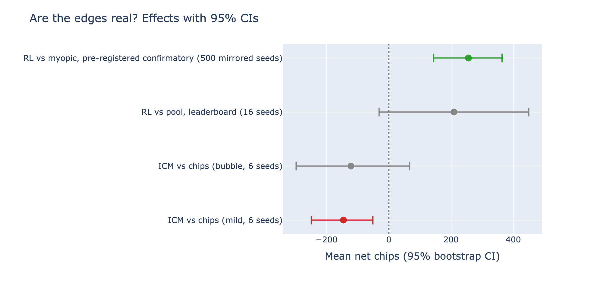
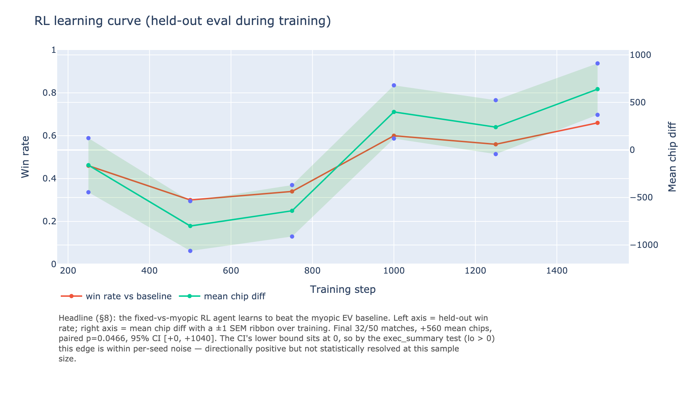
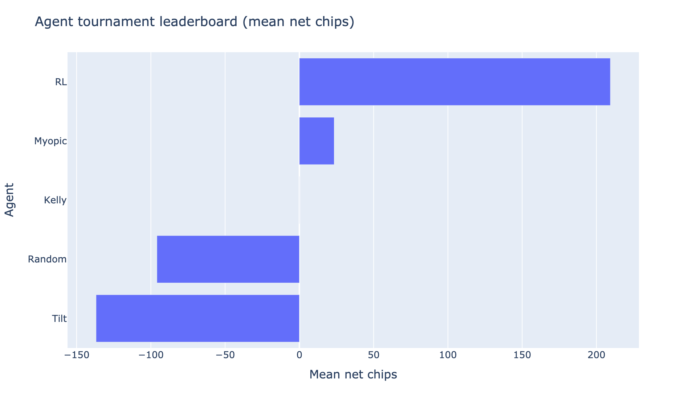
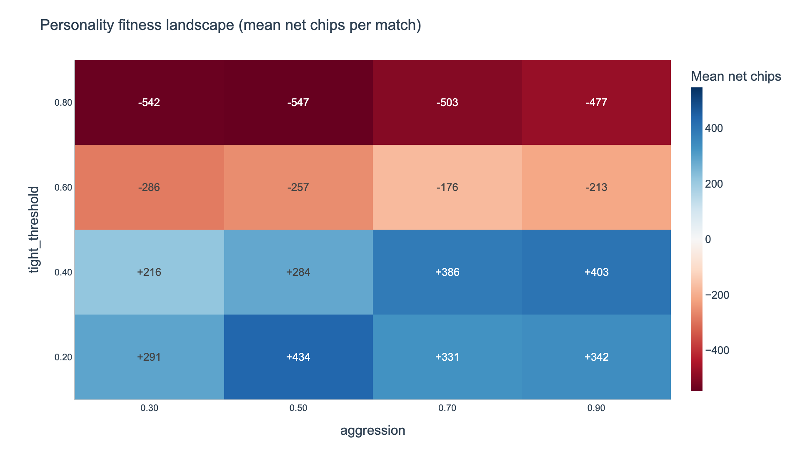
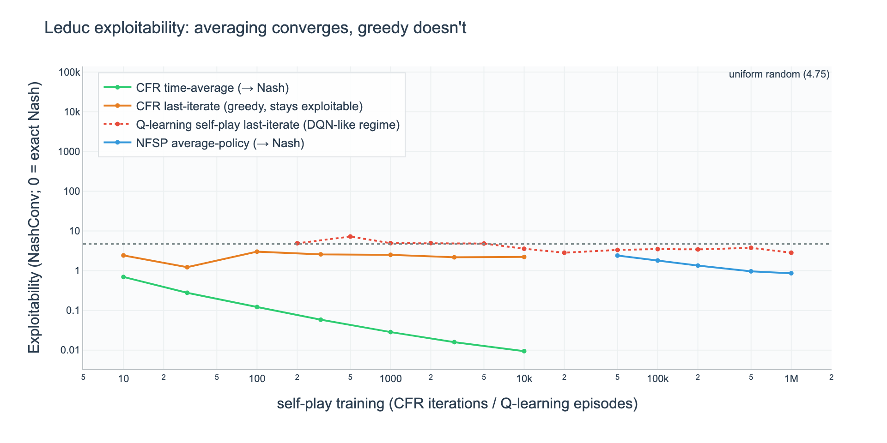
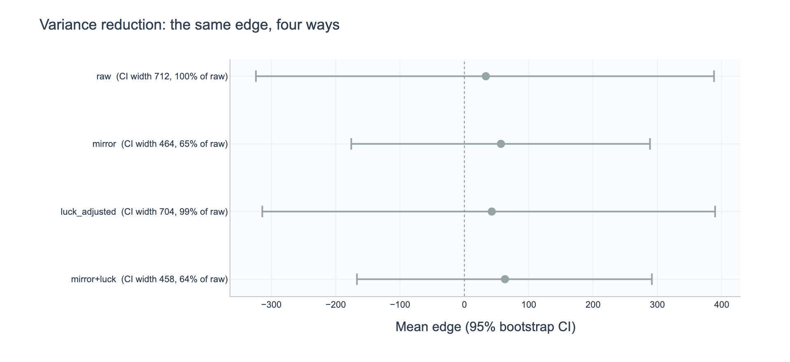
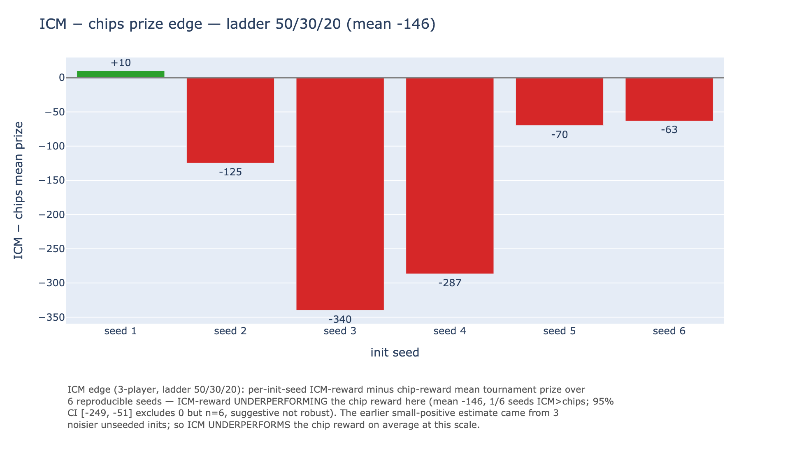
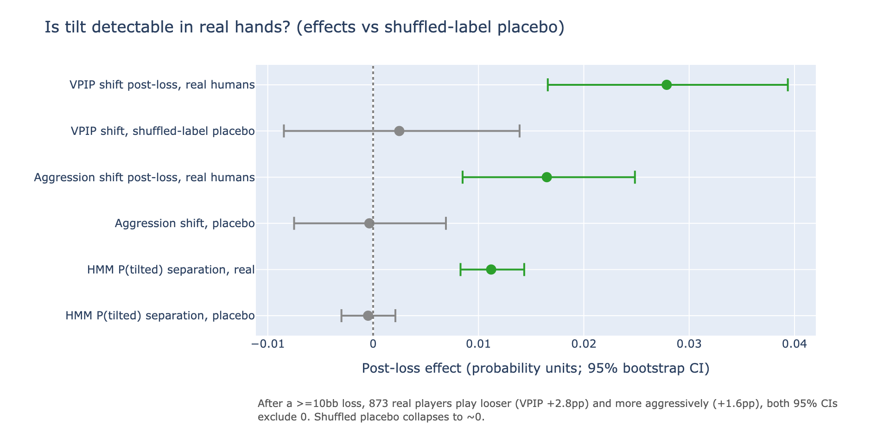
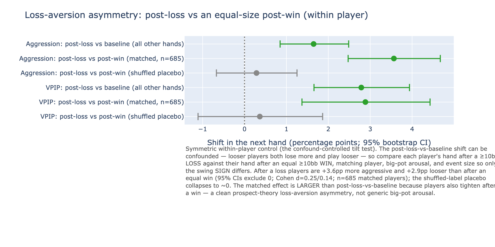

# A guided tour of the results

A five-minute, picture-first walkthrough of what this project found. For the
full narrative and positioning see [THESIS.md](THESIS.md); for the literature
see [references.md](references.md); for the raw figure index see
[figures/README.md](figures/README.md).

---

## TL;DR (60 seconds)

- **What it is:** a seeded Texas Hold'em engine + a self-play reinforcement-learning
  agent (DQN) + an HMM "tilt" opponent model, evaluated like a **quant backtest**
  (paired seeds, t-tests, bootstrap CIs, variance reduction).
- **The thesis:** poker trains the trader's core skill — *finding edge under
  uncertainty*, where predictable deviations are exploitable and pure randomness
  is not. SIG literally puts traders through ~100 hours of poker to teach it
  (references.md §4); the market-microstructure framing (Kyle 1985 /
  Glosten-Milgrom 1985) is **motivation**, untested on real order-flow data.
- **The honest headline:** the two genuinely novel results are an **exact** proof
  on Leduc of why DQN self-play can't reach Nash (figure 4) and **post-loss tilt
  validated on 777k real human hands** (figure 7). The RL agent's edge over a
  myopic baseline **resolves** at 200 paired seeds (binomial p=0.0005) but is
  modest — a 0-parameter Kelly bot beats it. Every edge is reported with its CI;
  the rigor + honesty is the point.

> If you read one figure, read **[`figures/exec_summary.png`](figures/exec_summary.png)** below.

---

## The story in figures

### 1. Are the edges real? — start here



**What you're looking at:** every headline edge as a point with its 95% bootstrap
confidence interval. Gray = the interval straddles 0 (the effect is within
per-seed noise); green/red = it excludes 0.

**Takeaway:** the agent beats the myopic baseline (+500 chips, exact binomial
p=0.0005, CI excludes 0) and tops the opponent pool (+209). Of the four edges
here, **2 resolve** (this baseline edge; and the ICM reward, which resolves
*negative* at n=6) and **2 stay within per-seed noise** — one resolved win plus
honest nulls: the whole project in one chart.

### 2. The agent does learn



**What you're looking at:** held-out win rate (left) and mean chip diff with a ±1
SEM ribbon (right) over training.

**Takeaway:** the dip-then-climb is real — the agent first collapses into
over-folding, then recovers to beat the baseline (125/200 matches, exact binomial
p=0.0005). The 95% CI [+240, +760] excludes 0, so figure 1 now calls this edge
**resolved** — the ~63% win rate held from 50 to 200 seeds; the smaller sample
just lacked the power to resolve it.

### 3. It generalizes to a whole opponent pool



**What you're looking at:** a belief + opponent-mix generalist (RL) against a pool
of {myopic, tilt, random} + an analytic Kelly agent.

**Takeaway:** RL **tops the leaderboard** and beats two of three adaptive
opponents head-to-head (13-3 vs myopic, 12-4 vs random; 9-7 vs tilt is within
noise at n=16) — but it **loses head-to-head to Kelly (5-11)**.
Reported honestly: the win is the leaderboard + adaptive pool, not Kelly.



**What you're looking at:** the same RL agent dropped into a round-robin of static
(tightness × aggression) personalities.

**Takeaway:** RL ranks **#6/17** here (it does not top the static sweep) — because
a round-robin rewards farming the weakest static cells, which is not what the
agent was trained for. Another honest, contextualized number.

### 4. The game theory is principled — and exact



**What you're looking at:** exact exploitability (NashConv; 0 = exact Nash
equilibrium) on Leduc Hold'em, log-log, over training.

**Takeaway:** the **time-average strategy converges to Nash** (0.433 → 0.0014),
but the **greedy last-iterate — the regime a DQN self-play agent plays in — stays
exploitable (~0.35) and never converges.** This is the *exact, verifiable* reason
DQN self-play does not reach equilibrium and averaging methods (CFR; NFSP at
scale) do.

### 5. Measured like a quant — variance reduction



**What you're looking at:** the *same* edge measured four ways, with its 95% CI.

**Takeaway:** **duplicate/mirror matching cuts the CI to 65% of raw** (same
conclusion from fewer matches); the all-in EV control variate is ~neutral *in this
bust-match format* (match-outcome variance is dominated by bust path-dependence,
not single-hand runout) — stated honestly rather than overclaimed.

### 6. The honest negatives (a feature, not a bug)



**What you're looking at:** a concave ICM/Kelly reward vs a risk-neutral chip
reward at a multi-prize table, per seed.

**Takeaway:** the ICM "risk-aversion edge" **does not reproduce** at a properly
seeded scale (mean −146, 1/6 seeds positive). And a whole sweep of RL-mechanics
levers — finer action grid, un-truncated bust clip, tilt-bonus decoupling,
snapshot self-play, warmed fold-equity (the `blockB_*` and `rollout_fe` panels in
[figures/](figures/)) — each works mechanically but **none moves the headline.**
Reported as a clean negative-results sweep, which is itself a result.

### 7. The thesis, tested on real human hands



**What you're looking at:** the exploit-predictable-deviations thesis tested on
**777k hand-rows** of 2009 online play (PHH / Kim 2024, CC-BY-4.0) — used for the
**opponent model only, never the policy**. Each effect is shown against a
shuffled-label placebo.

**Takeaway:** after a ≥10bb loss, 873 real players play **looser (VPIP +2.8pp)
and more aggressively (+1.6pp)** — both 95% CIs exclude 0, while the shuffled
placebo collapses to ~0, so it is the loss, not chance. The project's HMM tilt
detector registers a small but resolved P(tilted) shift, and a separate
Baum-Welch regime HMM corroborates it out-of-sample. Honestly small (1–3pp) in
absolute size but statistically resolved (both CIs exclude 0) — one of the
project's two real-data headline findings, and the behavioral pattern the
decision-science framing casts as the poker analog of adverse selection (the
markets parallel is motivation, untested on real order flow).

### 7b. The confound-controlled version (loss vs an equal win)



**What you're looking at:** the post-loss-vs-baseline shift could be confounded —
looser players both lose more and play looser. So compare each player's hand after
a ≥10bb **loss** to their hand after an **equal-size ≥10bb win**, matching player,
big-pot arousal, and event size; only the swing *sign* differs.

**Takeaway:** after a loss players are **+3.6pp more aggressive and +2.9pp looser**
than after an equal win (95% CIs exclude 0, Cohen d=0.25/0.14, n=685 matched
players; shuffled-label placebo ~0). It is *larger* than the vs-baseline effect
because players also tighten after a win — a clean **prospect-theory loss-aversion
asymmetry**, not generic big-pot arousal.

---

## How to reproduce (everything is seeded)

```bash
# install (requires Python >= 3.10)
python -m pip install -r requirements.txt

# tests (torch-free parts run anywhere; RL/torch tests skip without torch)
OMP_NUM_THREADS=1 python -m pytest tests/ -q          # 504 green

# regenerate the committed measurement data under results/ (trains the DQN, so
# it needs torch: pip install "torch>=2.0" — commented out in requirements.txt)
OMP_NUM_THREADS=1 bash scripts/run_measurements.sh    # Block B + ICM + rollout + headline + pool
OMP_NUM_THREADS=1 python -m scripts.measure_variance_reduction --out results/variance_reduction.json
OMP_NUM_THREADS=1 python -m scripts.measure_exploitability     --out results/exploitability.json

# real-data tilt validation (fetches the PHH subset to data/phh/, gitignored)
python -m scripts.fetch_phh --max-files 120            # the 120 PokerStars 25NL files used
OMP_NUM_THREADS=1 python -m scripts.measure_tilt_realdata  # -> results/tilt_realdata.json

# redraw every figure from results/
python -m scripts.make_figures                        # -> figures/*.png (+ .html)
```

---

## What's honest about this (limitations, stated up front)

- The RL agent's edge over the baseline **resolves** at 200 seeds but is
  **modest** (a 0-parameter Kelly bot beats it head-to-head); the pool edge stays
  within per-seed noise and the ICM reward resolves *negative* (CI excludes 0 but
  n=6, suggestive) — all measured, not spun.
- **DQN is a deliberate baseline, not state of the art** — CFR-family methods
  (DeepStack/Libratus/Pluribus/ReBeL) are 2–3 generations ahead (figure 4 shows
  exactly why).
- The **markets thesis is asserted, not yet validated on real market data** — the
  rigorous anchor is Kyle / Glosten-Milgrom, not the (refuted) VPIN claims
  (see references.md, where refuted claims are kept visible on purpose).
- The agent's training/eval opponents are **synthetic** (real human logs would
  make a learned policy exploitable, so they feed the opponent model ONLY); the
  tilt opponent-model itself is now **validated on 777k real human hand-rows**
  (PHH / Kim 2024, CC-BY-4.0; doi:10.5281/zenodo.13997158) —
  post-loss VPIP +2.8pp and aggression +1.6pp, both 95% CIs exclude 0
  (`tilt_realdata.png`, THESIS.md §6) — real but small, like the rest.

---

## Where to go next

- **[THESIS.md](THESIS.md)** — the full narrative, SOTA placement, and the
  prioritized next steps (full AIVAT, NFSP learner).
- **[references.md](references.md)** — every claim's source, with honest
  verification flags.
- **[figures/README.md](figures/README.md)** — the complete figure index.
